# 家校任务助手 - 产品功能流程图

## 🎯 角色定义

### 主要角色
1. **家长** - 主要用户，管理孩子的学习任务
2. **学生** - 任务的执行者（未来规划）
3. **系统** - AI 智能解析和自动化处理

---

## 📊 核心业务流程图

### 1. 用户注册与登录流程


---

### 2. 首次使用流程（添加学生）

```mermaid
graph TD
    A[登录后] --> B[跳转到首页]
    B --> C{有学生?}

    C -->|否| D[显示添加学生引导]
    C -->|是| E[显示现有学生列表]

    D --> F[点击"添加学生"按钮]
    F --> G[打开添加学生模态框]

    G --> H[输入学生姓名]
    H --> I[选择年级]
    I --> J[可选: 输入班级]

    J --> K[提交表单]
    K --> L[学生添加成功]
    L --> M[刷新学生下拉列表]

    E --> N[可以选择现有学生]
    N --> O[准备创建任务]

    M --> O
    O --> P[✅ 学生管理完成]

    style A fill:#e1f5ff
    style P fill:#c8e6c9
    style G fill:#fff9c6
```

---

### 3. 创建任务主流程

```mermaid
graph TD
    A[首页 - 创建任务] --> B[选择学生]
    B --> C[输入作业内容/上传图片]
    C --> D[点击"AI 智能解析"]

    D --> E{AI 解析}
    E -->|成功| F[跳转到确认页面]
    E -->|失败| G[显示错误提示]

    G --> H[修改输入内容]
    H --> C

    F --> I[确认页面]
    I --> J[显示解析结果]
    J --> K[编辑任务信息]

    K --> L[修改科目标签]
    K --> M[修改截止日期]
    K --> N[修改任务描述]

    L --> O[点击"确认创建任务"]
    M --> O
    N --> O

    O --> P{创建成功?}
    P -->|是| Q[显示成功提示弹窗]
    P -->|否| R[显示错误信息]

    R --> S[返回修改]
    S --> I

    Q --> T{用户选择}
    T -->|查看任务| U[3秒自动跳转]
    T -->|继续添加| V[点击按钮返回首页]
    T -->|等待倒计时| U

    U --> W[任务中心 /my-tasks]
    V --> A

    W --> X[✅ 任务创建完成]

    style A fill:#e1f5ff
    style X fill:#c8e6c9
    style Q fill:#fff9c6
    style F fill:#e8f5e9
```

---

### 4. 任务中心管理流程

```mermaid
graph TD
    A[任务中心 /my-tasks] --> B[加载任务列表]
    B --> C[显示统计卡片]

    C --> D[紧急任务]
    C --> E[警告任务]
    C --> F[待完成任务]
    C --> G[全部任务数]

    D --> H[筛选选项]
    E --> H
    F --> H
    G --> H

    H --> I[按学生筛选]
    H --> J[按科目筛选]
    H --> K[按状态筛选]
    H --> L[快捷筛选]

    L --> M[今天要完成]
    L --> N[本周任务]
    L --> O[已逾期]
    L --> P[待完成]

    I --> Q[显示筛选后的任务列表]
    J --> Q
    K --> Q
    M --> Q
    N --> Q
    O --> Q
    P --> Q

    Q --> R{任务操作}

    R -->|查看附件| S[点击附件缩略图]
    R -->|编辑任务| T[点击编辑按钮]
    R -->|标记完成| U[点击完成按钮]

    S --> AA[附件预览功能 - 详见流程6]
    T --> BB[任务编辑功能 - 详见流程7]
    U --> V[更新任务状态]
    V --> W[任务显示为已完成]

    W --> X[✅ 任务管理完成]

    style A fill:#e1f5ff
    style X fill:#c8e6c9
    style S fill:#e8f5e9
    style T fill:#fff9c6
```



---

### 5. 学生管理流程

```mermaid
graph TD
    A[学生管理页 /students] --> B[加载学生列表]
    B --> C{有学生?}

    C -->|否| D[显示"暂无学生"提示]
    C -->|是| E[显示学生卡片列表]

    D --> F[添加学生]

    E --> G{学生操作}
    G -->|编辑| H[点击编辑按钮]
    G -->|删除| I[点击删除按钮]

    F --> J[打开添加学生表单]
    J --> K[输入学生信息]
    K --> L[提交添加]
    L --> M[✅ 添加成功]

    H --> N[打开编辑模态框]
    N --> O[修改学生信息]
    O --> P[保存修改]
    P --> Q[✅ 更新成功]

    I --> R[显示确认对话框]
    R --> S{确认删除?}
    S -->|取消| T[返回]
    S -->|确认| U[调用删除 API]
    U --> V[✅ 删除成功]

    M --> W[刷新列表]
    Q --> W
    V --> W
    T --> W

    W --> X[✅ 学生管理完成]

    style A fill:#e1f5ff
    style X fill:#c8e6c9
    style M fill:#e8f5e9
    style Q fill:#e8f5e9
    style V fill:#e8f5e9
```

---

### 6. 附件预览功能流程


---

### 7. 任务编辑功能流程


---

## 🔄 完整用户旅程地图

### 场景 1: 首次使用 → 创建第一个任务


### 场景 2: 日常使用 - 管理任务


### 场景 3: 附件预览与下载


---

## 📱 页面导航图


---

## 🎨 功能模块关系图


---

## 📊 数据流向图


---

## 🔐 权限与数据隔离


---

## 📈 用户使用路径

### 新用户第一周使用路径

```
Day 1: 注册 → 添加学生 → 创建第一个任务
Day 2: 查看任务 → 标记完成 → 添加新任务
Day 3: 编辑任务信息 → 管理学生 → 附件预览
Day 4: 批量创建任务 → 使用筛选功能
Day 5: 完善任务标签 → 调整截止日期
Day 6: 删除过期任务 → 添加第二个学生
Day 7: 完整使用所有功能
```

---

## 🎯 核心功能总结

### ✅ 已实现功能
1. 用户注册与登录
2. 学生管理（CRUD）
3. 任务创建（AI 解析）
4. 任务确认与编辑
5. 任务列表查看
6. 任务筛选（学生、科目、状态）
7. 任务完成标记
8. 任务编辑功能
9. 附件上传与预览
10. 附件下载
11. 成功提示与页面跳转

### 🚧 待实现功能
1. 任务通知提醒
2. 统计分析页面
3. 任务分享功能
4. 学生独立端
5. 暗黑模式
6. 批量操作
7. 快捷键支持

---

**文档版本**: v2.0
**最后更新**: 2026-01-14
**包含流程**: 7个核心流程 + 完整用户旅程
